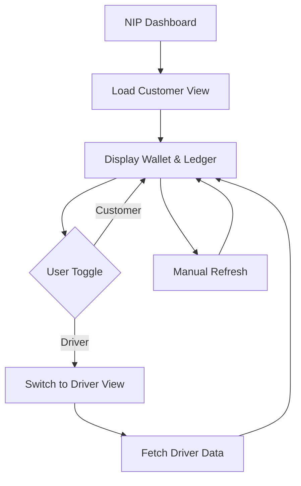

## 1. Product Overview
NIP Coin Dashboard provides real-time visibility into digital currency earnings for OTW platform users. Customers and drivers can track their wallet balance, total earnings, and transaction history through a unified interface with role-based views.

The dashboard solves the problem of opaque reward tracking by providing transparent, real-time access to NIP coin balances and earning history for both customer and driver roles in the OTW ecosystem.

## 2. Core Features

### 2.1 User Roles
| Role | Registration Method | Core Permissions |
|------|---------------------|------------------|
| Customer | Platform registration | View wallet balance, track NIP earnings from rides |
| Driver | Platform registration | View wallet balance, track NIP earnings from completed rides |

### 2.2 Feature Module
The NIP Dashboard consists of the following main page:
1. **NIP Dashboard**: Customer/Driver toggle, wallet balance display, recent ledger entries, refresh functionality.

### 2.3 Page Details
| Page Name | Module Name | Feature description |
|-----------|-------------|---------------------|
| NIP Dashboard | View Toggle | Switch between Customer and Driver views to see role-specific wallet data |
| NIP Dashboard | Wallet Display | Show current NIP coin balance and total lifetime earnings |
| NIP Dashboard | Ledger Entries | Display recent transaction history with timestamps, amounts, and reasons |
| NIP Dashboard | Refresh Button | Manually refresh wallet and ledger data from backend API |

## 3. Core Process
**User Flow**: User navigates to NIP Dashboard → System loads default Customer view → User can toggle to Driver view → Dashboard fetches and displays wallet balance + ledger entries → User can manually refresh data

## 4. User Interface Design

### 4.1 Design Style
- Primary color: #111827 (dark gray for active states)
- Secondary color: #f8fafc (light gray backgrounds)
- Button style: Rounded corners with hover states
- Font: System fonts (ui-monospace for code elements)
- Layout style: Card-based with clean separation between wallet and ledger sections
- Icon style: Minimal text-based indicators

### 4.2 Page Design Overview
| Page Name | Module Name | UI Elements |
|-----------|-------------|-------------|
| NIP Dashboard | Header | Title "NIP Coin Dashboard" with Customer/Driver toggle buttons |  
| NIP Dashboard | Wallet Section | Card displaying balance and total earned with clear labels |
| NIP Dashboard | Ledger Section | Scrollable list of transactions with amount, reason, and timestamp |
| NIP Dashboard | Status Indicators | Loading states, error messages, empty states |

### 4.3 Responsiveness
Desktop-first design with mobile-adaptive layout. Touch interaction optimized for toggle buttons and refresh functionality.