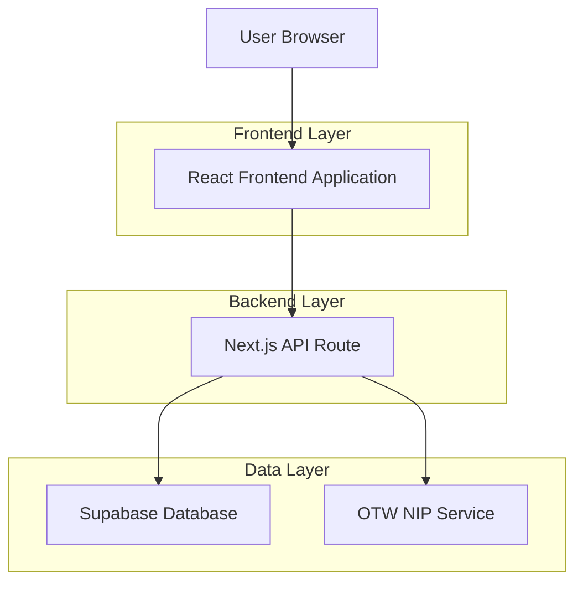
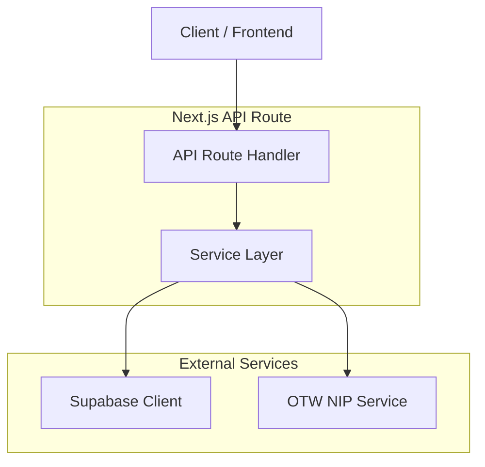
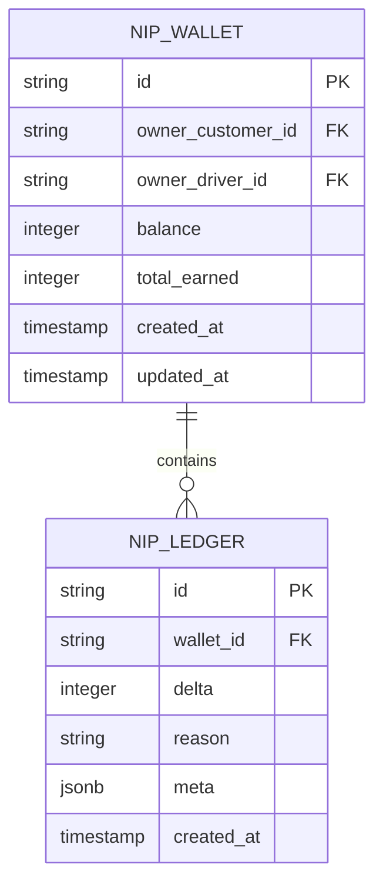

## 1. Architecture Design



## 2. Technology Description
- Frontend: React@18 + TypeScript + CSS Modules + Next.js App Router
- Initialization Tool: create-next-app
- Backend: Next.js API Routes
- Database: Supabase (PostgreSQL)
- External Service: OTW NIP Service Integration

## 3. Route Definitions
| Route | Purpose |
|-------|---------|
| /otw/nip | Main NIP Dashboard page displaying wallet and ledger |
| /api/otw/nip/summary | API endpoint fetching wallet and ledger data for customers/drivers |

## 4. API Definitions

### 4.1 Core API

**NIP Summary API**
```
GET /api/otw/nip/summary?customerId={id}
GET /api/otw/nip/summary?driverId={id}
```

Request Parameters:
| Param Name | Param Type | isRequired | Description |
|------------|-------------|-------------|-------------|
| customerId | string | false | Customer ID for customer view |
| driverId | string | false | Driver ID for driver view |

Response:
| Param Name | Param Type | Description |
|------------|-------------|-------------|
| success | boolean | Operation status |
| mode | string | View mode (customer/driver) |
| customerId | string | Customer ID if customer mode |
| driverId | string | Driver ID if driver mode |
| wallet | object | Wallet data with balance and earnings |
| ledger | array | Array of ledger entries |
| error | string | Error message if failed |

Example Response:
```json
{
  "success": true,
  "mode": "customer",
  "customerId": "cus_demo_1",
  "wallet": {
    "balance": 150,
    "totalEarned": 500,
    "ownerCustomerId": "cus_demo_1"
  },
  "ledger": [
    {
      "id": "ledger_123",
      "createdAt": "2024-01-15T10:30:00Z",
      "delta": 50,
      "reason": "RIDE_COMPLETION",
      "meta": {"requestId": "req_456"}
    }
  ]
}
```

## 5. Server Architecture Diagram



## 6. Data Model

### 6.1 Data Model Definition


### 6.2 Data Definition Language

**NIP Wallets Table**
```sql
-- create table
CREATE TABLE nip_wallets (
    id UUID PRIMARY KEY DEFAULT gen_random_uuid(),
    owner_customer_id VARCHAR(255) UNIQUE,
    owner_driver_id VARCHAR(255) UNIQUE,
    balance INTEGER NOT NULL DEFAULT 0,
    total_earned INTEGER NOT NULL DEFAULT 0,
    created_at TIMESTAMP WITH TIME ZONE DEFAULT NOW(),
    updated_at TIMESTAMP WITH TIME ZONE DEFAULT NOW()
);

-- create indexes
CREATE INDEX idx_nip_wallets_customer ON nip_wallets(owner_customer_id);
CREATE INDEX idx_nip_wallets_driver ON nip_wallets(owner_driver_id);
```

**NIP Ledger Table**
```sql
-- create table
CREATE TABLE nip_ledger (
    id UUID PRIMARY KEY DEFAULT gen_random_uuid(),
    wallet_id UUID NOT NULL REFERENCES nip_wallets(id),
    delta INTEGER NOT NULL,
    reason VARCHAR(100) NOT NULL,
    meta JSONB,
    created_at TIMESTAMP WITH TIME ZONE DEFAULT NOW()
);

-- create indexes
CREATE INDEX idx_nip_ledger_wallet ON nip_ledger(wallet_id);
CREATE INDEX idx_nip_ledger_created ON nip_ledger(created_at DESC);

-- grant permissions
GRANT SELECT ON nip_wallets TO anon;
GRANT SELECT ON nip_ledger TO anon;
GRANT ALL PRIVILEGES ON nip_wallets TO authenticated;
GRANT ALL PRIVILEGES ON nip_ledger TO authenticated;
```