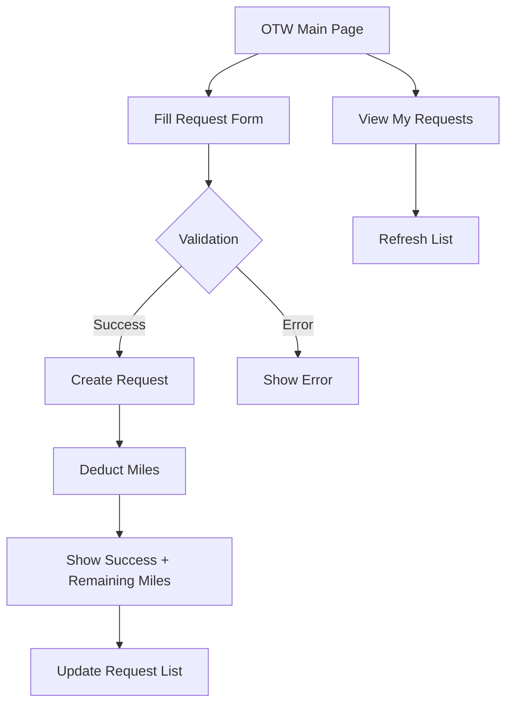

## 1. Product Overview

OTW (On The Way) customer portal enables users to book delivery services and track their requests. This MVP provides a simple interface for customers to create OTW requests with membership-based mileage system and view their request history.

The portal solves the problem of convenient local delivery services with transparent pricing based on membership tiers, helping customers get items delivered efficiently while managing their monthly mileage allowances.

## 2. Core Features

### 2.1 User Roles

| Role            | Registration Method          | Core Permissions                                                |
| --------------- | ---------------------------- | --------------------------------------------------------------- |
| Demo Customer   | Hard-coded ID (cus\_demo\_1) | Create OTW requests, view own requests, check membership status |
| Future Customer | Email registration (TBD)     | Full customer portal access, membership management              |

### 2.2 Feature Module

The OTW customer portal consists of the following main pages:

1. **OTW Main Page**: Combined view with request form and request list
2. **Request Form**: Service selection, mileage input, optional notes
3. **My Requests**: List of user's OTW requests with status tracking

### 2.3 Page Details

| Page Name     | Module Name          | Feature description                                                               |
| ------------- | -------------------- | --------------------------------------------------------------------------------- |
| OTW Main Page | Header Section       | Display page title and brief description of OTW service                           |
| OTW Main Page | Request Form Section | Service type dropdown, estimated miles input, optional notes field, submit button |
| OTW Main Page | My Requests Section  | List all user requests with service type, status, creation time, estimated miles  |
| Request Form  | Service Selection    | Choose from ERRAND, FOOD, BIG\_HAUL, VIP service types                            |
| Request Form  | Mileage Input        | Enter estimated OTW miles (internal calculation, not road miles)                  |
| Request Form  | Notes Field          | Optional text field for additional instructions                                   |
| Request Form  | Submit Action        | POST to /api/otw/requests, show success/error feedback                            |
| Request Form  | Membership Feedback  | Display tier name, remaining miles after request creation                         |
| My Requests   | Request List         | Show all requests for demo customer, sorted by creation time                      |
| My Requests   | Request Card         | Display service type badge, status, request ID, creation time, estimated miles    |
| My Requests   | Refresh Action       | Manual refresh button to reload request list                                      |

## 3. Core Process

**Customer Request Flow:**

1. Customer visits OTW page
2. Selects service type from dropdown
3. Inputs estimated OTW miles
4. Optionally adds notes
5. Clicks "Send OTW" button
6. System validates membership and mileage availability
7. If eligible, creates request and deducts miles
8. Shows success message with request details and remaining miles
9. Request appears in "My OTW Requests" list

**Request List Flow:**

1. Page loads with demo customer ID
2. Fetches requests via GET /api/otw/requests?customerId=...
3. Displays requests in chronological order
4. Customer can refresh list manually

## 4. User Interface Design

### 4.1 Design Style

* **Primary Colors**: Clean white background (#ffffff) with subtle borders (#e0e0e0)

* **Accent Colors**: Success green (#f5fff5), error red (#b00020), upgrade yellow (#fff9e8)

* **Button Style**: Rounded corners (999px border-radius), modern flat design

* **Typography**: System fonts, 0.85rem base size for forms, 1.1rem for titles

* **Layout**: Card-based components with consistent spacing (1rem padding)

* **Icons**: Text-based indicators (✅, 🔼) for simplicity

### 4.2 Page Design Overview

| Page Name     | Module Name      | UI Elements                                                                           |
| ------------- | ---------------- | ------------------------------------------------------------------------------------- |
| OTW Main Page | Container        | Max-width 800px, centered layout, 1.5rem padding                                      |
| OTW Main Page | Header           | Bold title (1.4rem), descriptive subtitle (0.9rem, #555555)                           |
| Request Form  | Form Card        | White background, 12px border radius, 1px border (#e0e0e0)                            |
| Request Form  | Service Dropdown | Native select element, 8px border radius, 0.85rem font                                |
| Request Form  | Mileage Input    | Number input with step=10, min=1, help text below                                     |
| Request Form  | Notes Textarea   | 70px min-height, vertical resize, placeholder text                                    |
| Request Form  | Submit Button    | Rounded pill style, disabled during submission                                        |
| Request Form  | Success Box      | Green background (#f5fff5), border (#d0e8d0), shows request ID, tier, remaining miles |
| Request Form  | Upgrade Box      | Yellow background (#fff9e8), dashed border (#ffd27f), shows recommended tier          |
| My Requests   | List Card        | White background, 12px border radius, 1px border                                      |
| My Requests   | Request Item     | Top border separator, 0.55rem padding, service badge and status                       |
| My Requests   | Service Badge    | Gray background (#f7f7f7), rounded pill, 0.75rem font                                 |
| My Requests   | Status Text      | Bold font-weight, 0.75rem size                                                        |
| My Requests   | Meta Info        | Gray color (#555555), 0.78rem font, shows ID, date, miles                             |

### 4.3 Responsiveness

* **Desktop-first approach**: Optimized for desktop viewing

* **Mobile adaptation**: Components stack vertically, maintain readability

* **Touch interaction**: Buttons and form elements sized for touch targets

* **No complex responsive breakpoints**: Simple fluid layout with max-width container

