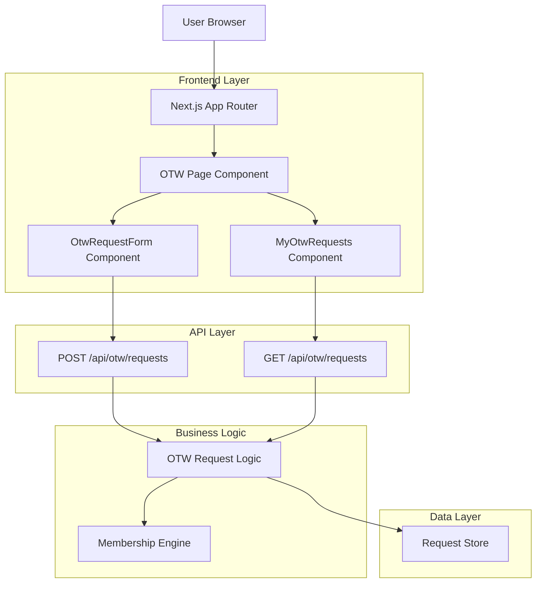
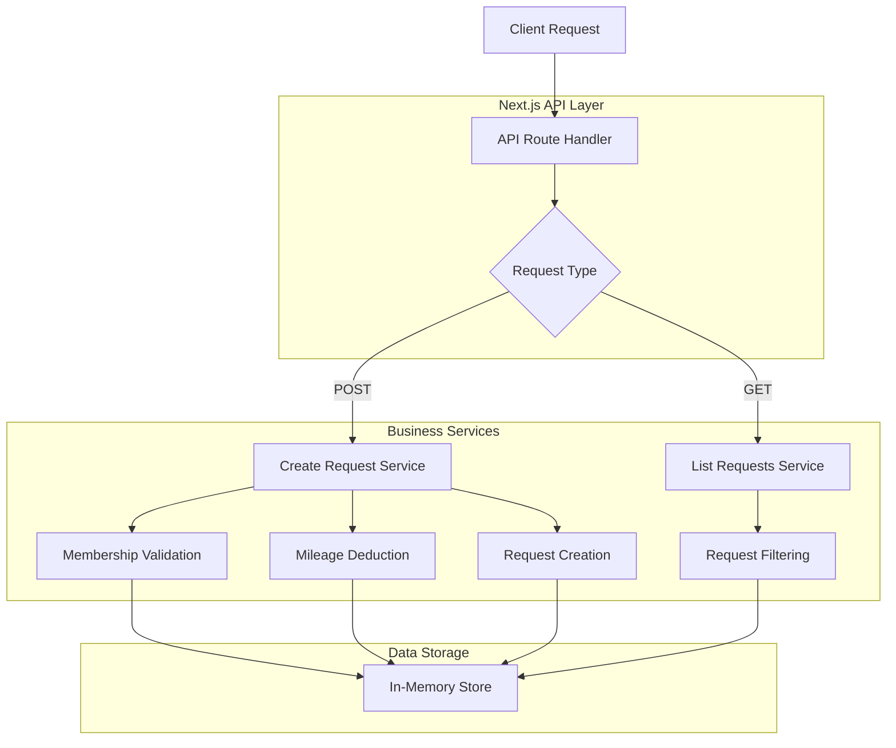
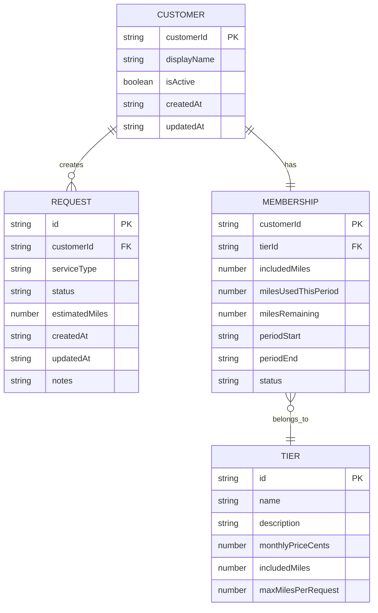

## 1. Architecture Design



## 2. Technology Description
- **Frontend**: Next.js 14 + React 18 + TypeScript
- **Styling**: CSS Modules (component-scoped styles)
- **Routing**: App Router (app/(public)/otw/page.tsx)
- **State Management**: React useState/useEffect (local component state)
- **API**: Next.js API Routes (/api/otw/requests)
- **Data Storage**: In-memory store (requestStore array)
- **Build Tool**: Next.js built-in bundler

## 3. Route Definitions
| Route | Purpose |
|-------|---------|
| /otw | Customer-facing OTW portal page |
| /api/otw/requests | POST: Create new OTW request |
| /api/otw/requests | GET: List requests for customer |

## 4. API Definitions

### 4.1 Create OTW Request
```
POST /api/otw/requests
```

Request:
| Param Name | Param Type | isRequired | Description |
|------------|------------|-------------|-------------|
| customerId | string | true | Customer identifier (demo: "cus_demo_1") |
| serviceType | string | true | Service type: "ERRAND", "FOOD", "BIG_HAUL", "VIP" |
| estimatedMiles | number | true | Estimated OTW miles (must be > 0) |
| notes | string | false | Optional customer notes |
| pickupLocation | object | false | Location object with lat/lng/label |
| dropoffLocation | object | false | Location object with lat/lng/label |

Response Success (201):
| Param Name | Param Type | Description |
|------------|-------------|-------------|
| success | boolean | Request creation status |
| request | object | Created request object with id, status, etc. |
| membership | object | Updated membership with remaining miles |
| tier | object | Membership tier definition |
| eligibility | object | Eligibility check results |

Response Error (400/500):
| Param Name | Param Type | Description |
|------------|-------------|-------------|
| success | boolean | Always false for errors |
| error | string | Error message |
| details | object | Additional error details |

Example Request:
```json
{
  "customerId": "cus_demo_1",
  "serviceType": "ERRAND",
  "estimatedMiles": 500,
  "notes": "Pick up groceries from Kroger"
}
```

### 4.2 List Customer Requests
```
GET /api/otw/requests?customerId={customerId}
```

Query Parameters:
| Param Name | Param Type | isRequired | Description |
|------------|------------|-------------|-------------|
| customerId | string | true | Customer identifier to filter requests |

Response Success (200):
| Param Name | Param Type | Description |
|------------|-------------|-------------|
| success | boolean | Request list status |
| requests | array | Array of request objects |

Response Error (400/500):
| Param Name | Param Type | Description |
|------------|-------------|-------------|
| success | boolean | Always false for errors |
| error | string | Error message |

## 5. Server Architecture Diagram



## 6. Data Model

### 6.1 Data Model Definition


### 6.2 Data Definition Language

Current implementation uses in-memory storage. For production deployment, here are the recommended PostgreSQL table definitions:

**Customers Table**
```sql
CREATE TABLE customers (
    id VARCHAR(255) PRIMARY KEY,
    display_name VARCHAR(255) NOT NULL,
    email VARCHAR(255),
    phone VARCHAR(50),
    is_active BOOLEAN DEFAULT true,
    created_at TIMESTAMP WITH TIME ZONE DEFAULT NOW(),
    updated_at TIMESTAMP WITH TIME ZONE DEFAULT NOW()
);
```

**Requests Table**
```sql
CREATE TABLE otw_requests (
    id VARCHAR(255) PRIMARY KEY,
    customer_id VARCHAR(255) NOT NULL,
    service_type VARCHAR(50) NOT NULL,
    status VARCHAR(50) NOT NULL DEFAULT 'PENDING',
    estimated_miles INTEGER NOT NULL,
    notes TEXT,
    created_at TIMESTAMP WITH TIME ZONE DEFAULT NOW(),
    updated_at TIMESTAMP WITH TIME ZONE DEFAULT NOW(),
    
    INDEX idx_customer_requests (customer_id, created_at DESC)
);
```

**Memberships Table**
```sql
CREATE TABLE memberships (
    customer_id VARCHAR(255) PRIMARY KEY,
    tier_id VARCHAR(50) NOT NULL,
    included_miles INTEGER NOT NULL,
    miles_used_this_period INTEGER DEFAULT 0,
    period_start TIMESTAMP WITH TIME ZONE NOT NULL,
    period_end TIMESTAMP WITH TIME ZONE NOT NULL,
    status VARCHAR(50) DEFAULT 'ACTIVE',
    created_at TIMESTAMP WITH TIME ZONE DEFAULT NOW(),
    updated_at TIMESTAMP WITH TIME ZONE DEFAULT NOW()
);
```

**Tiers Table**
```sql
CREATE TABLE tiers (
    id VARCHAR(50) PRIMARY KEY,
    name VARCHAR(255) NOT NULL,
    description TEXT,
    monthly_price_cents INTEGER NOT NULL,
    included_miles INTEGER NOT NULL,
    max_miles_per_request INTEGER NOT NULL,
    perks JSONB,
    allowed_service_types JSONB
);
```